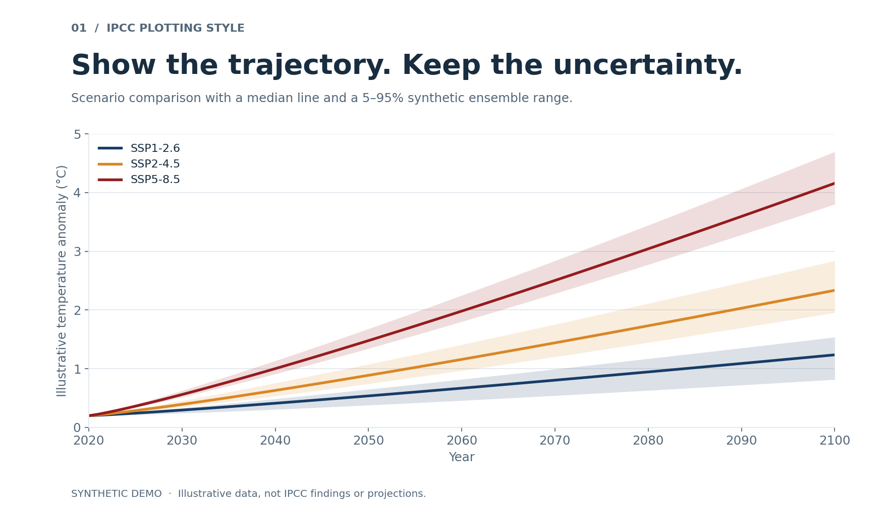
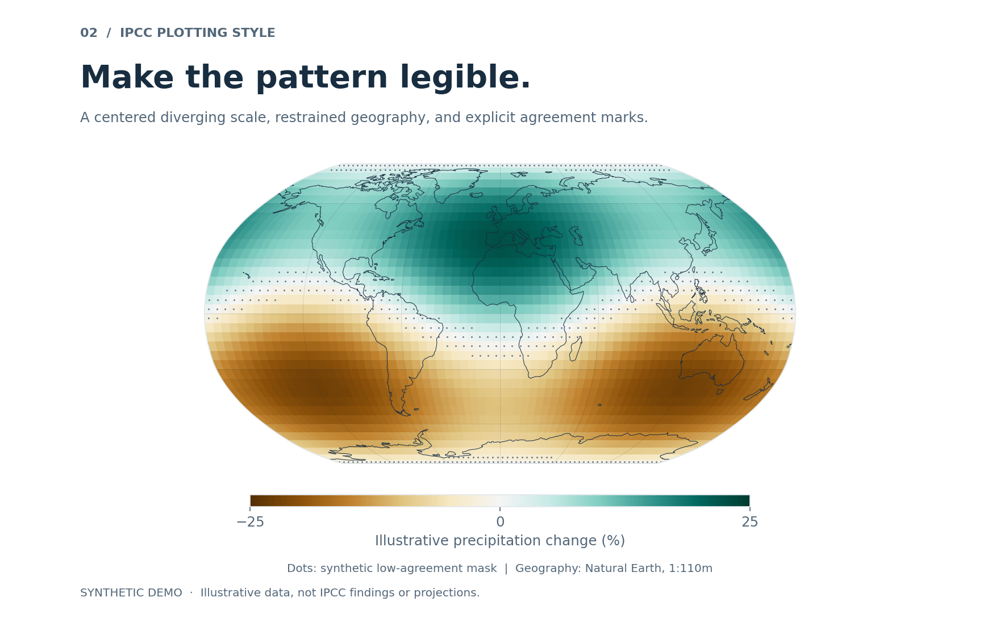
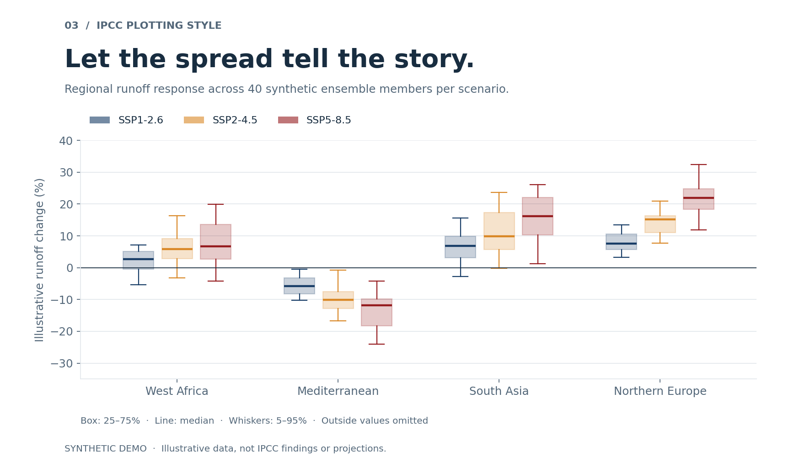

<p align="center">
  <a href="README.md">English</a> · <a href="README.zh-CN.md">简体中文</a> · <strong>日本語</strong>
</p>

<p align="center">
  
</p>

<h1 align="center">IPCC Plotting Style</h1>
<p align="center"><strong>出典をたどれる視覚表現を、気候研究の図へ。</strong></p>
<p align="center">
  <a href="https://github.com/GISWLH/IPCC/actions/workflows/checks.yml"></a>
  
  
  <a href="https://github.com/GISWLH/IPCC/stargazers"></a>
</p>

<p align="center">
  <a href="#overview">概要</a> · <a href="#quick-start">クイックスタート</a> · <a href="#gallery">作例</a> · <a href="#method">手法</a> · <a href="CONTRIBUTING.md">貢献ガイド</a>
</p>

<a id="overview"></a>
## 概要

**IPCC Plotting Style は、IPCC 第1作業部会の公開作図コードに見られる表現上の工夫を、再利用可能な科学可視化ワークフローにまとめたプロジェクトです。** ローカルの参照資料、用途別のスタイルガイド、実行可能な作例を組み合わせ、配色、レイアウト、シナリオ比較、不確実性の表示を根拠に基づいて設計できるようにします。

Codex、Claude、およびコマンドラインから利用でき、降水、流出、干ばつ、地域の水ストレス、アンサンブル比較などの研究に適しています。検索結果には出典情報が保持され、作例は小規模な合成データから再生成できます。

| 参照資料の基盤 | 監査で確認した範囲 |
|---|---:|
| 上流リポジトリ | **135** |
| 名前から明示的に識別できる図の対象¹ | **122** |
| 索引内のコード・Notebook レコード | **3,465** |
| 図のカテゴリ | **9** |

¹ 122 という数は、**図に特化した121個のリポジトリの名前**から算出しています。複数の図番号を持つ名前は展開し、同じ図のパネル違いは統合しています。**65の対象には、コードが同梱されたリポジトリが対応**します。残る57の対象は、対応する図別リポジトリ内では参照情報またはメタデータのみです。章全体を扱うリポジトリには、さらに別の資料が含まれます。これらは図の完全な再現数や読解した論文数を示すものではありません。対応表と集計範囲は[コーパス監査・集計規則](docs/corpus-methodology.md)（英語）で確認できます。

**検索はローカルで完結します。** Python 標準ライブラリだけで動作し、API キー、埋め込みサービス、データベースは不要です。独立したコミュニティプロジェクトであり、IPCC に所属するものでも、公式の承認を受けたものでもありません。

<a id="quick-start"></a>
## クイックスタート

検索には Python **3.10+** を使用します。任意の作図デモは Python **3.12** で検証しています。

```bash
git clone https://github.com/GISWLH/IPCC.git
cd IPCC

# ローカルに存在するコードと出典を検索。依存パッケージの導入は不要です。
python scripts/search_ipcc_examples.py "scenario uncertainty" --family time_series --limit 3
python scripts/search_ipcc_examples.py "stippling" --family map --json
```

メインコマンドは、利用可能な各ソースファイルから最も関連度の高いチャンクを返します。結果には上流リポジトリ、元のパス、コミット、正規化されたローカルのパスが含まれます。`--json` は JSONL 出力、`--all-types` は未同梱の入力データ、文書、出力図への参照も検索するオプションです。

より細かく絞り込む場合：

```bash
python scripts/ipcc_rag_search.py "uncertainty" --repo Chapter-11 --source-only --unique-files
```

アシスタントのスキルとして使う場合は、そのインストール機構で本リポジトリを `ipcc-plotting-style` として登録するか、[SKILL.md](SKILL.md) を直接参照させてください。スキルをコピーする際は、`scripts/` と `references/` を同ファイルと一緒に保持します。

> 「降水変化の地図を、ゼロを中心とする発散型カラースケールと、モデル間の一致度が低い領域を示す点描で作成してください。まず IPCC のコード例を検索し、設計上の選択を説明したうえで、元のコードを引用してください。」

<a id="gallery"></a>
## 再現可能な作例

**以下の値はすべて合成データです。** 図の表現方法を示す作例であり、IPCC の知見や将来予測を表すものではありません。

### 01 · シナリオの推移と不確実性

中央値の推移とアンサンブルの5–95%区間を重ね、代表値とばらつきを同時に示します。シナリオの配色を統一することで、複数の図の比較を支えます。



### 02 · 空間変化と一致度

Robinson 図法、ゼロを中心とする発散型カラースケール、点描により、空間的な特徴と解釈上の条件を区別します。マスクは説明用の規則であり、統計的な評価ではありません。



### 03 · 地域別アンサンブル分布

グループ化した箱ひげ図で4地域・3シナリオを比較します。箱は四分位範囲、ひげは5–95%の分位範囲に基づき、その外側の値は表示していません。



仮想環境の利用を推奨します。任意の作図依存パッケージを導入し、すべての作例を生成します：

```bash
python -m pip install -r requirements-demo.txt
python examples/generate.py
```

`results/demos/` に PNG/PDF と、実際の合成配列、乱数シード、パッケージのバージョン、スタイルの参照元を記録したマニフェストが出力されます。SVG には `--formats png pdf svg` を追加してください。小容量の Natural Earth 陸域データをチェックサム付きで同梱しているため、描画時のダウンロードは不要です。[作例ガイド](examples/README.md)（英語）も参照してください。

<a id="method"></a>
## 出典から実行可能な図へ

| 段階 | 手法 | 目的 |
|---|---|---|
| ソースの収録 | 選定したスクリプト、コードのみの Notebook、Python エクスポート | 大規模な気候データなしで作図の実装を確認する |
| 構造化索引 | リポジトリ、パス、コミット、カテゴリを持つ JSONL チャンク | 元のソースとの追跡可能な関係を保持する |
| カテゴリ選択 | 9種類の図と、要点を整理した参照ガイド | 可視化の目的に対応する表現を選ぶ |
| ローカル検索 | 文書長で正規化した語のスコア、パス・カテゴリ加点、ファイル単位の重複排除 | 実際に確認できるローカルコードを提示する |
| 適用と検証 | ソース確認、合成データによる描画、出典マニフェスト | 表現上の工夫を、実行・確認できる作例にする |

実装は**キーワード検索**であり、埋め込み検索やモデルのファインチューニングは使用していません。`fill_between`、`boxplot`、`stippling`、`colorbar` など、具体的な英語の作図用語が有効です。README の言語を切り替えても、索引や検索のトークン化規則は変わりません。言語メタデータが個々のファイルではなく上流リポジトリの主要言語を示す場合もあります。元の索引生成スクリプトは配布されていません。[手法の詳細](docs/corpus-methodology.md)では、確認可能な実装と、記録が残されていない制作過程を区別しています。

対応カテゴリ：`map`、`time_series`、`distribution`、`uncertainty`、`multi_panel`、`color_style`、`raster_stripes`、`bar_hist_density`、`scatter`。

## プロジェクト構成

| 場所 | 役割 |
|---|---|
| [SKILL.md](SKILL.md) | アシスタントのワークフローと出力要件 |
| [scripts/](scripts/) | 検索コマンド、再利用可能な検索関数、コーパス監査 |
| [examples/](examples/) · [assets/](assets/) · [results/](results/) | 作例コード、掲載用プレビュー、ローカル生成結果 |
| [references/evidence/](references/evidence/) | 図のカテゴリ別ガイド |
| [references/rag/](references/rag/) | 13,219件の索引レコードと分類表 |
| [references/source-code/](references/source-code/) | 1,141個のアーカイブ済みソースファイルと別途の収録マニフェスト |
| [tests/](tests/) · [docs/](docs/) | 動作検証、手法、出典、プロジェクトガイド |

## 開発と検証

```bash
python -m venv .venv
source .venv/bin/activate  # Windows PowerShell: .venv\Scripts\Activate.ps1
python -m pip install -r requirements-demo.txt
python -m unittest discover -s tests -v
python scripts/audit_corpus.py --check
python examples/generate.py
```

検索とコーパス監査のテストに外部パッケージは不要です。作図依存パッケージがなければデモのテストは明示的にスキップされます。CI では依存パッケージを導入し、全テストを実行します。ソースやプレビューを変更する前に[貢献ガイド](CONTRIBUTING.md)（英語）を確認し、3言語の README で集計値とコマンドの整合性を保ってください。

## 出典表記と適用範囲

表現方法を取り入れる際は、上流リポジトリ、ファイルのパス、コミット、元の著者を記載してください。スタイルの参照は科学データの引用に代わるものではなく、不確実性の算出根拠にもなりません。大規模な気候データは同梱せず、アーカイブ内のスクリプトには元の環境が必要な場合があります。

ソースアーカイブには上流ごとに異なる利用条件があり、プロジェクト全体に適用する一律のライセンスは宣言されていません。再配布前に[出典とライセンス](docs/provenance.md)（英語）を確認してください。Natural Earth の地理データはパブリックドメインで、正確な出典は[データ説明](examples/data/README.md)に記録しています。

研究に役立ったら、GitHub のスターで他の研究者にも見つけてもらいやすくなります。再現可能な作例、具体的な不具合報告、丁寧な出典表記も、コミュニティへの大切な貢献です。
