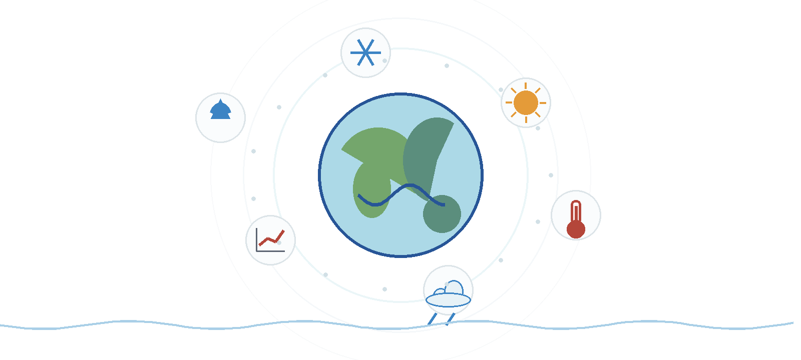

# IPCC Plotting Style Skill



`ipcc-plotting-style` is a self-contained Codex/Claude skill distilled from public IPCC-WG1 figure and chapter code. It helps generate, adapt, and review climate-science figures with IPCC-like visual conventions, especially for climate change hydrology: precipitation change, runoff response, drought and flood risk, snow and ice shifts, regional water stress, ensemble uncertainty, and scenario comparison.

The skill does not try to reproduce every original IPCC figure. Instead, it turns the public IPCC-WG1 plotting codebase into a searchable style and provenance library. A user can ask for an IPCC-style map, scenario time series, uncertainty band, ensemble boxplot, heatmap, or multi-panel figure; the skill retrieves relevant IPCC evidence before producing plotting code.

## Why This Matters

Climate change hydrology often requires communicating complex evidence: historical observations, future emission scenarios, multi-model ensembles, regional differences, and uncertainty. IPCC figures are valuable because they show mature visual solutions for these problems: clear colorbars, compact legends, uncertainty hatching, scenario color discipline, readable panel layouts, and provenance-aware figure construction.

This skill packages those patterns into a reusable workflow. It is useful when preparing research figures, teaching material, technical reports, or paper drafts where the figure should communicate climate and hydrological change clearly rather than merely display raw model output.

## What Is Included

The distributed skill is intentionally compact. It includes:

- `SKILL.md`: the skill entry point and workflow contract.
- `references/evidence/`: distilled guidance for maps, time series, uncertainty, distributions, color style, raster/stripes, bars/density, scatter plots, and multi-panel layouts.
- `references/rag/`: bundled RAG index files for local retrieval.
- `references/source-code/`: code-only IPCC-WG1 source bundle. Notebook outputs, figures, and large data files are excluded.
- `scripts/search_ipcc_examples.py`: the user-facing retrieval entry point.
- `scripts/ipcc_rag_search.py`: dependency-free local keyword/BM25-like search.
- `assets/hero.png`: README header illustration.

Current package size is about 31 MB. The code-only IPCC-WG1 source bundle is about 15 MB, and the bundled RAG index is about 15 MB.

## Quick Use

Run a local retrieval query from this directory:

```powershell
python scripts\search_ipcc_examples.py "time series scenario uncertainty" --family time_series --limit 5
```

Example families:

- `color_style`
- `map`
- `time_series`
- `uncertainty`
- `multi_panel`
- `distribution`
- `raster_stripes`
- `bar_hist_density`
- `scatter`

For typical use inside Codex or Claude, install or expose this directory as a skill. The assistant will read `SKILL.md`, classify the requested plot type, retrieve IPCC-WG1 evidence, and generate plotting code with local provenance.

## Example Requests

- "Create an IPCC-style map of projected precipitation change with a diverging colorbar and hatching for low model agreement."
- "Make a scenario time series figure for runoff change with historical baseline, SSP lines, and uncertainty bands."
- "Plot a multi-panel climate hydrology summary with a map, regional boxplots, and a scenario time series."
- "Improve this drought-risk figure so it follows IPCC-style legend, colorbar, and uncertainty conventions."

## Source Provenance

The source material comes from public IPCC-WG1 GitHub repositories such as `Atlas`, `Chapter-7`, `Chapter-9`, `Chapter-11`, `Chapter-12`, and technical-summary figure repositories. The full upstream source mirror is not required to use this skill.

The bundled RAG index stores lightweight chunks with repository name, source path, commit, language, plot-family tags, and text/code evidence. When deeper inspection is needed, the code-only source bundle mirrors the relevant source paths under:

```text
references/source-code/IPCC-WG1/
```

Notebook files in this bundle are code-only: markdown cells, rendered outputs, and embedded images are removed. A `.py` export is also provided for easier reading.

## Regeneration

In the original development repository, the main maintenance scripts are:

- `scripts/build_ipcc_rag_index.py`
- `scripts/distill_plot_categories.py`
- `scripts/package_ipcc_code_sources.py`
- `scripts/test_ipcc_skill_environment.py`
- `scripts/run_ipcc_skill_ab_test.py`

The distributed skill itself already contains the retrieval index and source-code bundle, so normal users do not need the full development repository.

## Limitations

This package is a style and code-provenance skill, not a full IPCC figure reproduction archive. Large climate datasets, NetCDF files, CSV tables, Excel files, rendered plots, and notebook outputs are intentionally excluded.

The retrieval engine is lightweight keyword search, not an embedding database. It is fully local and dependency-free, but semantic recall can be improved in future versions with an optional embedding index.

## License and Attribution

This repository packages derived indexes, distilled guidance, and code-only excerpts from public IPCC-WG1 source repositories for research and educational use. Upstream source files retain their original provenance and licensing. When using specific code patterns, cite the source repository and file path surfaced by the RAG result.

